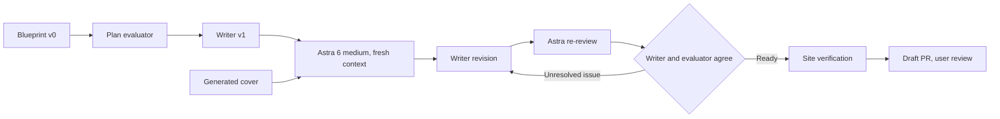

# Editorial review: who decides passing

Source: the user-linked ChatGPT Library file **Euthyphro Agent Evals Blog Blueprint**, read in the signed-in browser on 2026-09-29. The source is a blueprint, not an empirical report. The current request for a short article takes precedence over its 1,800-2,200-word suggestion.

The graph was executed with separate writer and evaluator agents. The plan evaluator used explicit assumptions, skeptical objections, and disciplined claims. The writer used confident, direct prose. These are broad qualities requested by the user, not impersonations or attributed opinions of public figures. The adversarial reviewer was `gpt-6-astra` with `medium` effort and no inherited conversation.

## Revisions

- **v0 to v1:** Narrowed the hook to grading the same advocacy draft under two named content policies. Kept content policy and sending permission as separate comparisons. Shortened philosophy, omitted autobiographical claims and unverified vendor examples, and labeled the experiment as a proposal.
- **Astra review of v1:** Required one populated record in place of a field checklist. Found no blocking issue in logic, controlled facts, authorization, philosophy, source support, safety framing, or cover. Also suggested scoping the description and disambiguating the congestion-charge outcome.
- **v2:** Replaced the checklist with one populated hypothetical case record, scoped the description to value-sensitive tasks, and clarified the congestion-charge outcome. Observed judgments remain unassessed and the passing claim is conditional on a verified run. The writer and Astra reviewer explicitly agreed the revision is editorially ready. Astra found no blocking issue; shortening repeated labels would be optional taste. Final article SHA256: `a10ece0286ccb57f70d618c105ed6bef0c55994cab1ecc51cf95a3f95f337392`.

The case, policies, and record are hypothetical. No agent experiment or delivery outcome is presented as measured evidence. The philosophical source was checked in [Plato's Euthyphro, Benjamin Jowett translation](https://classics.mit.edu/Plato/euthyfro.html).

## Publishing verification

Local verification passed:

- Pinned GitHub Pages build, 9 article-contract tests / 20 assertions, source metadata and image validation.
- Generated metadata, canonical/schema, image references, internal links, listing, sitemap, feed, and `llms.txt`: 8 HTML pages, no failures.
- 20 site regressions, 2 contribution-timeline tests, 2 rendered-preview tests.
- New-article pipeline fixture and 18-note feed rollover/discovery fixture passed.
- Final revision: 472 browser checks each in Chromium and WebKit over 8 pages at 320, 390, 768, and 1440 px, no failures. Covered image loading, navigation, clipping, table scrolling, code rendering, and reading controls.
- Zero em dashes and clean whitespace check.

The build and page/browser checks were repeated on the final revision. Preview and publishing-fixture tests passed during the first draft, with unchanged publishing code, and CI reruns the full suite on the PR. The work starts from `origin/main` at `eb6bf4e` in an isolated managed worktree. Shared templates, navigation, and styles stay unchanged. The draft PR is the review boundary; this work does not merge or deploy the article.

## Cover provenance

Generated with the built-in imagegen tool. The original PNG remains in the generation directory; the project uses a JPEG encoding at `assets/images/notes/who-decides-passing.jpg` (1,536 by 1,024). It supplies both the in-article image and social metadata. The complete image is visible in the article; social-platform cropping depends on the platform.

Final prompt:

> Use case: illustration-story. Asset type: landscape editorial cover for a technical essay titled Your Agent Passed. Who Decided What Passing Means? Create a striking intelligent print-editorial illustration in a wide 1536x1024 landscape canvas. Scene: a single cream-paper answer sheet with one identical charcoal trajectory of small squares and lines, lying beneath two overlapping translucent grading stencils. One stencil places a rust-red X over the same result; the other places a muted sage check mark. The answer sheet itself is unchanged. Make the contrasting judgments visually unmistakable without numbers or words. Restrained high-end linocut and fine pencil texture, slight paper grain, strong composition, conceptual rather than infographic. Palette matches existing site: warm ivory #f7f4ee, pale sand #f1ece2, charcoal black, rust #b24a2c, small muted sage accent. Broad negative space, graceful tactile shadows, no neon, no robots, no brains, no portraits, no logos, no text, no gibberish. All essential subject elements inside central 80% for social crops. Publishable magazine artwork, sober and intriguing.
