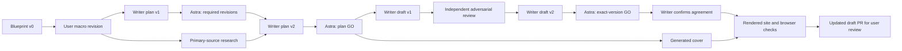

# Editorial review: Whose Bias Are We Building?

The original input was the user-linked **Euthyphro Agent Evals Blog Blueprint**. The first narrow agent-evaluation draft was superseded by the user's macro revision request: examine whose judgments govern the AI ecosystem, including economic allocation, political authority, affected outsiders, and successor development. This record covers the revised article only.

## Executed plan and draft loops

The writer ran `gpt-6.1-sol` with `medium` effort. The evaluator ran `gpt-6-astra` with `medium` effort. They were separate agents spawned with `fork_turns: none`, each receiving an explicit role, the user's constraints, and artifact paths. The evaluator read the actual draft before the writer's self-review. Neither model is claimed to be institutionally independent; separate contexts reduce shared drafting assumptions.

Four angles were considered: safety as capability allocation; who can appeal AI values; successor intelligence versus authority; neutrality as a purchasing condition. The first supplies the backbone, with the others supporting the causal argument.

Astra rejected plan v1. It required a sharper allocation-of-power thesis, morally serious treatment of the grocery example, a causal product/access/procurement progression, affected noncustomers, and a substantive ending. The writer revised the plan; Astra explicitly approved plan v2 before drafting.

Draft v1 passed substantive review. Astra independently checked the primary documents and cover. Its optional copy feedback removed a research-process aside and improved the Constitutional AI citation. The parent also identified that mere agreement should not be described as demonstrated compliance. The writer corrected that distinction in draft v2 and retained both limits on the Daybreak example: announced access establishes neither observed security gains nor exclusion of other defenders.

Astra then approved the exact final draft. The writer separately confirmed agreement without editing it. Final article SHA256: `19d229b2209ed1fecbc21975ac0a154f941338389e1ea97bbf8beee8da773bfb`. The integrated note is byte-identical to the approved draft. Body length is approximately 1,265 words, with three sections and eight precise primary-source footnotes.

The broad qualities requested for the initial writer and evaluator informed direct prose and skeptical reasoning, not impersonation or invented opinions of public figures.

## Claim boundaries

- The vegan CEO and ecological deployment are explicit hypotheticals. No dietary belief or grocery refusal is attributed to a real person or model.
- The Claude constitution and OpenAI Model Spec document intended behavior, not demonstrated compliance. The constitution is pinned to a specific source commit.
- OpenAI's Ukraine Daybreak announcement establishes an access commitment, not measured security outcomes or universal exclusion elsewhere.
- The Trump order and OMB implementation concern federal procurement. Eligibility, payment, termination, documentation and feedback supply the commercial mechanism, not a measured market-share effect.
- Amodei and OpenAI's stated support for regulation and independent assessment are represented fairly. Their forecasts and ambitions are not treated as observations.
- Constitutional AI describes a historical training method. It is not a complete account of current Claude training. Current research assistance is distinguished from hypothetical fully autonomous recursive self-improvement.
- The proposed standard of evidence, contestability and voice for affected outsiders is a normative position, not a discovered theorem or novel governance theory.

The full source-by-source adversarial review and exact-version re-review are retained alongside this record. Intermediate plans, writer responses, source dossier, and machine-readable graph remain locally in `.artifacts/editorial-macro`.

## Verification

The final prose was rendered with the existing pinned GitHub Pages build. Local checks passed:

- 9 article-contract tests, 20 assertions, zero failures or skips; metadata and image validation for 6 notes.
- Generated metadata, canonical/schema, image references, internal links, note index, sitemap, feed and `llms.txt`: 8 HTML pages, zero failures.
- 20 site regression tests and 2 contribution-timeline tests on the final render.
- 2 preview tests and the new-article fixture, including 18-note discovery/feed rollover, passed during integration. Publishing code did not change.
- 471 browser checks each in Chromium and WebKit over 8 pages at 320, 390, 768 and 1440 px, zero failures. Checks include images, navigation, clipping, footnotes and reading controls.
- Exact draft hash match, zero em dashes, and clean whitespace check.

The work starts from fresh `origin/main` at `eb6bf4e` in an isolated managed worktree. Shared templates, styles and navigation were not edited. The previous unpublished note, cover and obsolete review records were replaced. The existing draft PR is the user review boundary; nothing was merged or deployed.

## Cover provenance

Generated with the built-in imagegen tool using the previous cover only as a visual style reference. The original PNG remains in the generation directory. The site uses a JPEG encoding at `assets/images/notes/whose-bias-are-we-building.jpg`, 1,536 by 1,024 pixels. The key-and-city illustration is conceptual art, not an empirical diagram. Astra inspected and approved the image and alt text. It supplies both the article cover and social metadata; social cropping depends on the platform.

Final generation prompt:

> Use case: illustration-story. Generate a NEW landscape editorial cover for an essay titled Whose Bias Are We Building? The provided previous cover is a STYLE REFERENCE only: match its warm cream paper, rust ink, charcoal drawing, fine linocut grain and tactile print quality. Replace its subject entirely. New subject: three oversized, differently cut physical keys in rust, charcoal and muted olive hover at varied angles above a small intricate city-like network drawn on cream paper. The teeth of the keys become the architectural patterns of the city below, visually suggesting that human-authored access rules shape an entire growing ecosystem. Show streets, simple buildings and branching connections as printmaking abstractions, not tiny text or UI. The emerging city grows toward the horizon with a smaller second layer echoing some patterns, conveying future systems inheriting design choices without a sci-fi explosion. Intelligent striking magazine illustration, elegant perspective, strong graphic hierarchy, interesting asymmetry, broad negative space. Palette: ivory #f7f4ee, sand #f1ece2, charcoal, rust #b24a2c, small muted olive accents. No check marks or X stamps, no robot, no brain, no portraits, no politicians, no flags, no logos, no letters or words. Wide 1536 by1024 canvas, essential subjects in central80% so a social crop retains keys and city. This is conceptual art, not an empirical diagram.
